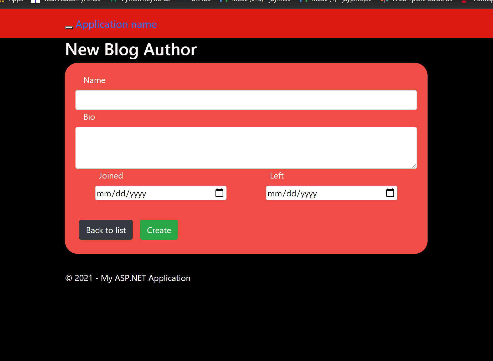
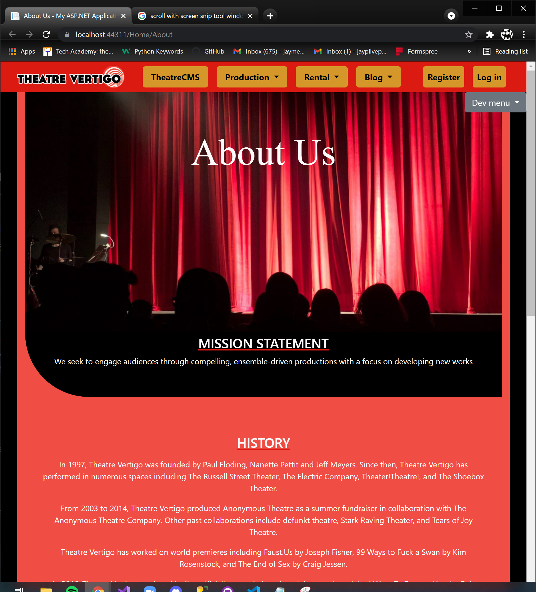

# **Live Project Experience**
-
Some examples/demonstrations of my work while I was part of a Scrum team.
I worked closely in colaberation with a team of devlolopers, using Microsoft Azure for version control, and Visual Studio(2019) as the IDE.

>The project was a website for a Theatre acting company, that encompassed basic CRUD pages for its users, admin, and staff, as well as
dynamic HTML pages to display information about themselves.

#####These are *some* of my contributions to the project:

##[About Page](https://github.com/JaySPryor/Live_Project_Experience/tree/main/Code%20summary/Code%20Snippets/About%20Page)

A simple info page that I styled using mostly custom CSS/HTML elements.

##[CRUD pages](https://github.com/JaySPryor/Live_Project_Experience/tree/main/Code%20summary/Code%20Snippets/Blog%20Authors)

I generated the CRUD pages for the Blog area of the website using Visual Studio's MVC templates, as well as assisted with the styleing. 
The majority of these styles were made using Bootstrap4.

